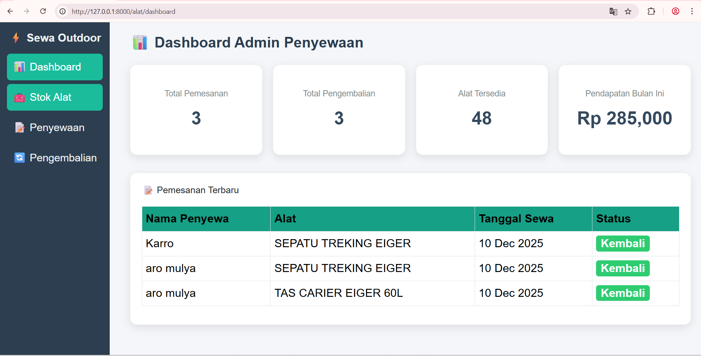

<p align="center">
    <a href="#" target="_blank">
        
    </a>
</p>

<p align="center">
<a href="#"></a>
<a href="#"></a>
<a href="#"></a>
<a href="#"></a>
</p>

---
## 📦 About the Project

📘 Sewa Outdoor — Sistem Penyewaan Peralatan Outdoor

Sewa Outdoor adalah aplikasi berbasis Laravel 11 untuk mengelola penyewaan peralatan outdoor seperti tenda, kompor portable, matras, senter, dan lain-lain.
Sistem ini menyediakan fitur lengkap mulai dari manajemen alat, pemesanan multi-item, pengembalian barang, hingga dashboard statistik.
---

🚀 Fitur Utama
✔️ Manajemen Alat

Tambah, ubah, hapus alat

Upload foto alat

Stok otomatis berkurang dan bertambah

✔️ Pemesanan Multi-Produk

Tambah banyak item sekaligus ke keranjang

Hitung subtotal per barang

Menghitung total berdasarkan durasi hari

Validasi stok otomatis

✔️ Pengembalian Barang

List barang yang sedang dipinjam

Proses pengembalian → stok kembali bertambah

Status berubah dari Dipinjam → Kembali

✔️ Dashboard

Ringkasan jumlah alat, penyewaan, dan pengembalian

Tampilan kartu statistik

Dashboard modern & responsif

---
🔧 Persyaratan Sistem

Pastikan instalasi berikut sudah tersedia:

PHP 8.2+

Composer

MySQL / MariaDB

Node.js (opsional)

Laravel 11
---

## 📸 UI Preview

> Replace these images with your own screenshots


---

## 📂 Installation

### 1️⃣ Clone Repository
```bash
git clone https://github.com/aromulya20/sewa-alat-outdorr.git
cd your-repo

2️⃣ Install Dependencies
composer install
npm install
npm run build

3️⃣ Create Environment File
cp .env.example .env


Set your database credentials:

DB_DATABASE=db_sewa_outdoor
DB_USERNAME=root
DB_PASSWORD=

4️⃣ Generate Key
php artisan key:generate

5️⃣ Run Migrations + Seeder
php artisan migrate --seed

6️⃣ Start Development Server
php artisan serve


Open the app:
👉 http://localhost:8000

📘 How to Use

Add products from the product menu

Upload product images

Create a purchase order

Select product → enter quantity → total auto-calculated

Submit order

View history in the transaction page

🤝 Contributing

Contributions are welcome!
Feel free to submit a pull request or open an issue.

🔐 License

This project is open-sourced under the MIT License.

📝 Author

Created by ARO MULYA PRATAMA
Feel free to connect or contribute!
---